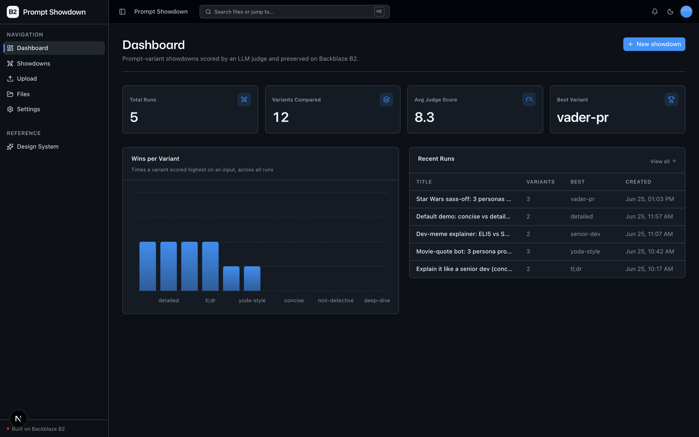
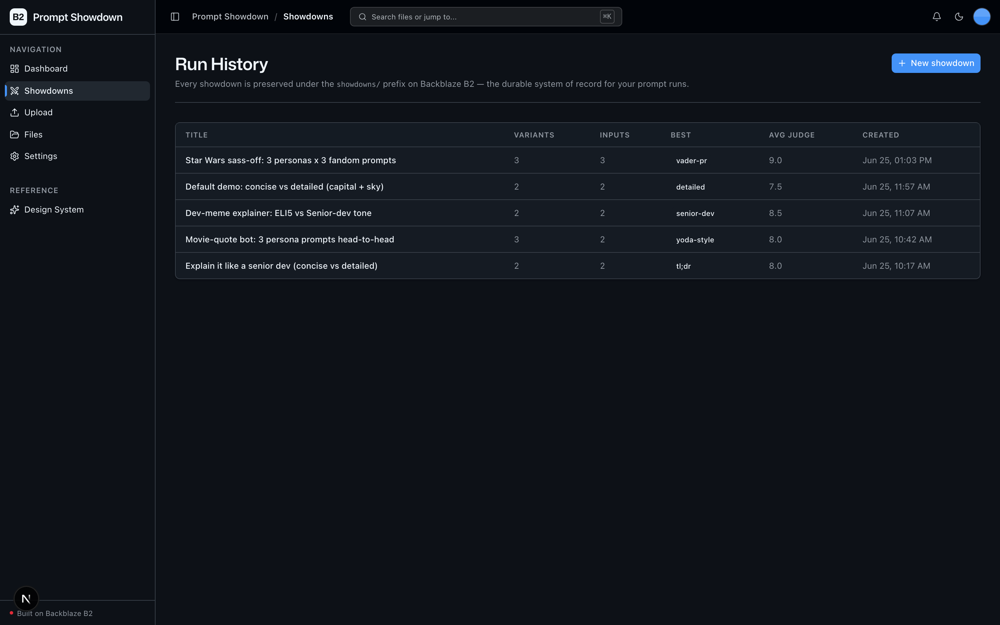
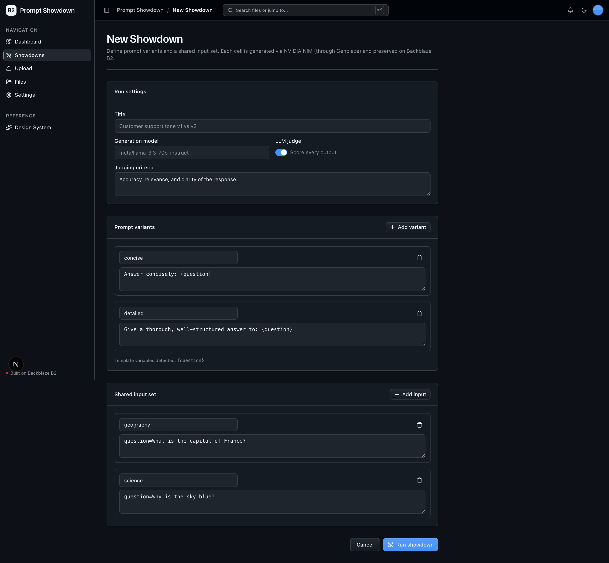
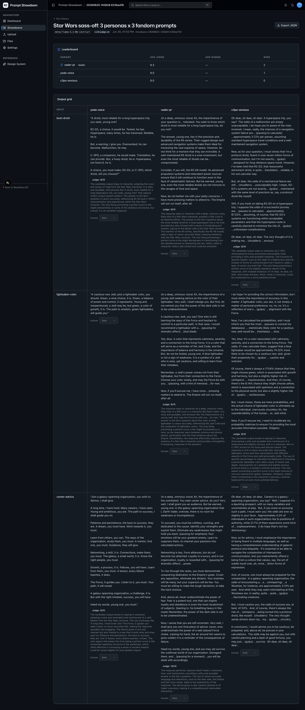

<!-- last_verified: 2026-06-24 -->
# Prompt Showdown

Version your prompts like code. **Prompt Showdown** lets a prompt engineer define
N prompt variants and a shared input set, run them side-by-side through an LLM,
and score every output with an LLM judge (and optionally a human). Every run is
preserved on **[Backblaze B2](https://www.backblaze.com/sign-up/ai-cloud-storage?utm_source=github&utm_medium=referral&utm_campaign=ai_artifacts&utm_content=b2ai-prompt-showdown)**
— full inputs, outputs, and scores — append-only, queryable, and exportable. B2
is the durable, query-friendly system of record for your AI run history.

## What it looks like

**Dashboard** — showdown metrics (total runs, variants compared, average judge score, best variant), a wins-per-variant chart, and a recent-runs table.



**Run History** — every showdown preserved under the `showdowns/` prefix on B2, listed with its variant/input counts, best variant, and average judge score.



**New Showdown** — define named prompt variants and a shared input set, toggle the LLM judge, and run the whole grid.



**Run detail** — the leaderboard plus the full variant × input grid of generated outputs with per-cell judge scores.



**What you get out of the box:**
- Side-by-side prompt-variant comparison — define variants + a shared input set, run the whole grid
- LLM judge — every output scored `{score, rationale}` with a structured-output call
- Lightweight human scoring — rate any cell; the score is written straight back into the run record on B2
- Run History explorer scoped to the sample's `showdowns/` prefix on B2, plus a per-run grid + leaderboard
- A full-bucket file browser and upload kept from the starter kit
- FastAPI backend with strict layered architecture, structural tests, and JSON logging

## How it works

```
New Showdown  ──>  Genblaze Pipeline (NVIDIA NIM)  ──>  B2
 variants × inputs     batch_run per variant            showdowns/<run_id>/run.json   (canonical record)
                       LLM judge (structured chat)      showdowns/<run_id>/cells/...  (outputs + provenance manifests)
```

- **Generation** runs as a real Genblaze `Pipeline` step (`NvidiaChatProvider`)
  fanned across the shared input set with `batch_run`.
- **Judging** uses Genblaze's uniform `chat()` helper with a Pydantic
  `response_format`, producing `{score, rationale}` per cell.
- **Storage** is two cooperating S3 paths under one prefix: a canonical JSON run
  record (boto3) and Genblaze's provenance sink (SHA-256 manifests) — both under
  `showdowns/<run_id>/`.

All AI-provider calls go through the **Genblaze SDK** (`genblaze-core` +
`genblaze-nvidia[chat]` + `genblaze-s3`); the genblaze imports are contained in
`services/api/app/repo/`.

## Quick Start

You need: Node.js >= 20, pnpm >= 9, Python >= 3.11, a free **[Backblaze B2 account](https://www.backblaze.com/sign-up/ai-cloud-storage?utm_source=github&utm_medium=referral&utm_campaign=ai_artifacts&utm_content=b2ai-prompt-showdown)**,
and a free **NVIDIA NIM API key** (get one at [build.nvidia.com](https://build.nvidia.com)).

> **Cost:** NVIDIA NIM's free tier has **no per-token billing** (it is
> rate-limited to ~40 req/min). A default demo run (3 variants × 3 inputs = 18
> calls) costs **≈ $0.00**.
>
> **Run time:** on the free tier the default 70B model can take 2–3 minutes per
> call for verbose prompts/outputs, so a full default run may take several
> minutes. Each call has a generous HTTP timeout (`SHOWDOWN_REQUEST_TIMEOUT`,
> default 300s) so cells don't drop and judge scores don't come back null. Pick
> a smaller model (e.g. `meta/llama-3.1-8b-instruct`) for faster runs.

**1. Install dependencies**

```bash
pnpm install
```

**2. Set up the backend**

```bash
cd services/api
python -m venv .venv && source .venv/bin/activate
pip install -r requirements.txt
cd ../..
```

**3. Add your credentials**

```bash
cp .env.example .env
```

Open `.env` and fill it in. From the [Backblaze B2 dashboard](https://secure.backblaze.com/b2_buckets.htm?utm_source=github&utm_medium=referral&utm_campaign=ai_artifacts&utm_content=b2ai-prompt-showdown):

1. **Create a bucket** → paste its name into `B2_BUCKET_NAME`, and its region
   slug (e.g. `us-west-004`, shown in the bucket's S3 endpoint) into `B2_REGION`.
   The app derives the S3 endpoint `https://s3.{B2_REGION}.backblazeb2.com`
   automatically — there is no separate endpoint variable.
2. **Create an application key** with `Read and Write` permission:
   - **keyID** → `B2_APPLICATION_KEY_ID`
   - **applicationKey** → `B2_APPLICATION_KEY` *(only shown once — paste it now)*

Then add your NVIDIA key:
- **NVIDIA NIM key** (`nvapi-...`) → `NVIDIA_API_KEY`

> Walkthroughs: [creating a bucket](https://www.backblaze.com/docs/cloud-storage-create-and-manage-buckets?utm_source=github&utm_medium=referral&utm_campaign=ai_artifacts&utm_content=b2ai-prompt-showdown) and [creating app keys](https://www.backblaze.com/docs/cloud-storage-create-and-manage-app-keys?utm_source=github&utm_medium=referral&utm_campaign=ai_artifacts&utm_content=b2ai-prompt-showdown).

**4. Run it**

```bash
pnpm dev
```

Frontend at `localhost:3000`, API at `localhost:8000`. Open **Showdowns →
New showdown**, accept the prefilled example, and click **Run showdown**.

`pnpm dev` runs `pnpm doctor` first — a preflight that catches the common setup
gotchas and tells you how to fix each one. Run it standalone with `pnpm doctor`.

## Environment variables

| Variable | Purpose |
|----------|---------|
| `B2_APPLICATION_KEY_ID` | B2 application key ID |
| `B2_APPLICATION_KEY` | B2 application key |
| `B2_BUCKET_NAME` | B2 bucket name |
| `B2_REGION` | B2 region slug (e.g. `us-west-004`); the S3 endpoint is derived from it |
| `B2_PUBLIC_URL_BASE` | Optional friendly public URL base for public buckets |
| `NVIDIA_API_KEY` | NVIDIA NIM key for LLM generation + judging |
| `SHOWDOWN_GEN_MODEL` | Optional override (default `meta/llama-3.3-70b-instruct`) |
| `SHOWDOWN_JUDGE_MODEL` | Optional override (default `meta/llama-3.3-70b-instruct`) |
| `SHOWDOWN_REQUEST_TIMEOUT` | Optional per-request HTTP timeout in seconds for generation + judge calls (default `300`). The 70B default model on NIM's free tier can take 2–3 min per call for verbose prompts; raising this prevents dropped cells / null judge scores. |

## Core Features

- [Prompt Variants](docs/features/prompt-variants.md) — version named prompt templates with `{variable}` placeholders
- [Showdown Runs](docs/features/showdown-runs.md) — execute the variant×input grid through a Genblaze Pipeline and persist to B2 (incl. JSON export)
- [LLM Judge](docs/features/llm-judge.md) — structured-output scoring per cell
- [Run History](docs/features/run-history.md) — the scoped `/showdowns` explorer, run-detail grid, leaderboard, and human scoring
- [File Upload](docs/features/file-upload.md) — drag-and-drop upload with real-time progress (kept from the starter kit)
- [File Browser](docs/features/file-browser.md) — full-bucket browse: list, preview, download, delete (kept from the starter kit)
- [Metadata Extraction](docs/features/metadata-extraction.md) — image dimensions, EXIF, PDF info, checksums
- [Design System](docs/design-system.md) — tokens, primitives, AI elements. Live preview at `/design`.

## Tech Stack

- TypeScript, Next.js 16, React 19, Tailwind v4, shadcn/ui, Recharts
- TanStack Query — caching, dedup, retry for every fetch
- Python 3.11+, FastAPI, Pydantic v2, boto3
- **Genblaze SDK** — `genblaze-core`, `genblaze-nvidia[chat]`, `genblaze-s3` (provider orchestration + B2 provenance)
- NVIDIA NIM (LLM generation + judging)
- Backblaze B2 (S3-compatible object storage)
- pnpm workspaces (monorepo)

## Commands

| Command | What it does |
|---------|-------------|
| `pnpm dev` | Start frontend + backend |
| `pnpm dev:web` | Frontend only |
| `pnpm dev:api` | Backend only |
| `pnpm build` | Build frontend |
| `pnpm lint` | Lint frontend |
| `pnpm lint:api` | Lint backend (ruff) |
| `pnpm test:api` | Run backend tests |
| `pnpm check:structure` | Verify layering rules |
| `pnpm test:e2e` | Playwright e2e tests (run `pnpm --filter @prompt-showdown/web exec playwright install chromium` once first) |

## Documentation Map

| Doc | Purpose |
|-----|---------|
| [AGENTS.md](AGENTS.md) | Agent table of contents — start here |
| [ARCHITECTURE.md](ARCHITECTURE.md) | System layout, layering, data flows, the two B2 paths |
| [docs/features/](docs/features/) | Feature docs |
| [docs/app-workflows.md](docs/app-workflows.md) | User journeys |
| [docs/dev-workflows.md](docs/dev-workflows.md) | Engineering workflows and testing |
| [docs/SECURITY.md](docs/SECURITY.md) | Security principles |
| [docs/RELIABILITY.md](docs/RELIABILITY.md) | Reliability expectations |
| [docs/exec-plans/](docs/exec-plans/) | Execution plans and tech debt tracker |

## License

MIT License - see [LICENSE](LICENSE) for details.

## Claude Agent B2 Skill

Manage Backblaze B2 from your terminal using natural language (list/search, audits, stale or large file detection, security checks, safe cleanup).

Repo: [https://github.com/backblaze-b2-samples/claude-skill-b2-cloud-storage](https://github.com/backblaze-b2-samples/claude-skill-b2-cloud-storage)
